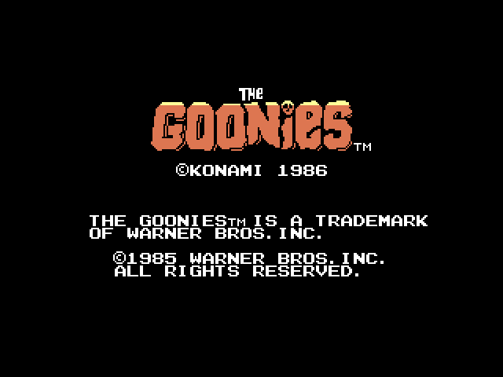

# Goonies WAVE patch

This repository contains a patch to the original Goonies game, released by Konami for [MSX](https://en.wikipedia.org/wiki/MSX) computers.  **Goonies** is a classic platform game developed and published by **Konami** for the **MSX** computer in 1986.  

## 🛠️ Project Description

The **patch** provided in this project is meant to be applied to the original Goonies ROM and it will add new music in WAVE format, replacing the original PSG music. 

In order to hear the new wave soundtrack, the patched game should be used with a [MSX Pico+ cartridge](https://www.msxpico.com/), made by Jeroen Taverne. It requires the firmware 2.05 or newer.

A new MSX palette, with better colors, is also added when running in a MSX2 computer.

Sound effects remain being played by PSG.  

After the initial release, a new option of music set is available. While the previous release included songs from BrainGames Goonies remake (Goonies 20th Anniversary Edition, released by BrainGames in 2006), this new set is a 100% BrainGames set, containing all the musics from the BrainGames Goonies remake, and used here with permission of the musician who did the songs, Jorrith Schaap. 

A comparative video showing the game with the original music and with the new music patch (with the release music set) can be seen here:  
🎥 [Goonies (MSX) video](https://youtu.be/oyCBmymLQ1M)

The game with the BrainGames music set can be seen here:  
🎥 [Goonies (MSX) video](https://youtu.be/-n7D72rfzH8)

## hash

The file to be patched must have the following hash:

**SHA256**:   `dde9aacde7f061c62ba93c34b9edfdb3a54fe8289b53dac72a2fc6826c03a841`

**SHA1**:     `250D0D6E646EAE4817802C49E367AD8C1C35A462`

**MD5**:      `e25e87aecc04f4e5047b9af12135cde1`

The patch can be applied with any patcher software that supports the IPS file format, e.g. Lunar IPS.

## How to use

After applying the patch, copy the wav files of the desired music set and the patched ROM to a folder in the sd card of your MSX Pico cartridge. 

Turn on your MSX with your Pico cartridge connected, and using Pico menu, navigate until the folder with the files and execute the game.

## Credits

- **Original Game**: "Goonies" (1986)
- **Original Publisher**: Konami 
- **Platform**: MSX
- **Patch programmer**: Maurício Braga 
- **WAVE musics**: produced by Jorrith Schaap and Riva Lima (2025). 

"The Goonies 'R' Good Enough" Written by Cyndi Lauper, Stephen Broughton Lunt, and Arthur Stead. Performed by Cyndi Lauper. © 1985 Epic Records

MSX Pico cartridge made by Jeroen Taverne.

Goonies is a trademark of Warner Bros Inc.

## Thanks

- Jorrith Schaap.
- Riva Lima.
- Jeroen Taverne.
- Stefano Baldo.
- Pedro de Medeiros.
- OpenMSX team.
- Patriek Lesparre (TNI).
- Albert Beevendorp (TNI).

## Legal notice

This repository is provided "as is" to owners of an original copy of the game. All rights to the original game remain with Konami and the original developers. 

The use of this repository might be illegal if you do not own an original copy of the game.

Also, the repository will be removed if Konami, Warner or their legal representatives ask me to do so.
